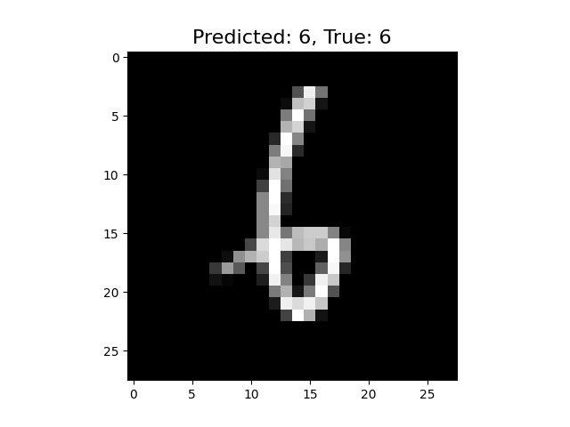

🤖 MNIST Handwritten Digit Recognition
Welcome to the MNIST Handwritten Digit Recognition project! 🎉 This project implements a machine learning model that recognizes handwritten digits from the MNIST dataset, a classic benchmark for evaluating image processing and classification algorithms.

📚 Table of Contents

 🌟Overview
 The MNIST dataset contains 70,000 images of handwritten digits (0-9), each represented as a 28x28 pixel grayscale image. Our goal is to develop an efficient model that can accurately classify these digits. This project serves as an excellent starting point for beginners in machine learning and deep learning, as it covers essential concepts in data preprocessing, model training, and evaluation.

📊 Dataset
The dataset consists of:

Training Set: 60,000 images for training the model.
Test Set: 10,000 images for evaluating the model's performance.
The images are pre-processed and normalized to enhance the model's learning efficiency.

🛠️  Technologies Used
This project leverages various tools and libraries:

    🐍 Python: The primary programming language. 
    📈TensorFlow/Keras: For building and training the neural network. 
    ⚙️ NumPy: For numerical operations. 
    📊 Matplotlib: For data visualization. 

    🚀 Installation
        - Clone the repo: 
        - Installation the required package

    🏗️Model Architecture 

      📸  Input Layer: Accepts the 28x28 pixel images. 📸
      🔍Convolutional Layers: Extracts features from the images. 
      ⬇️Pooling Layers: Reduces dimensionality while retaining important features. 
      🔗Fully Connected Layer: Classifies the features into digit categories. 
      📊Output Layer: Produces probabilities for each digit (0-9). 

🎉Results

     

